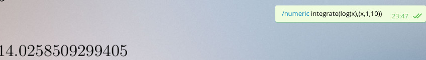
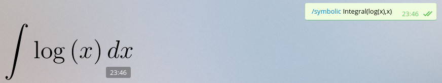

# Sympybot
Telegram bot that receives an Sympy expression and evalues it. Returns the result as a sticker.

You can use these commands:

/numeric [expression] -> eval the expression

/symbolic [expression] -> the same as numeric but without eval to float

/plot [expresion] -> graphical representation of the expression

## How I can use this bot?

* Install Python and pip
* Install [pyTelegramBotAPI](https://github.com/eternnoir/pyTelegramBotAPI) ``pip install pyTelegramBotAPI``
* Clone this repository (and submodules)
* [Get a Telegram Bot Token](https://core.telegram.org/bots)
* Export an environment variable called "TelegramToken" with your Token
* Run Sympybot.py

### License
GPL v2